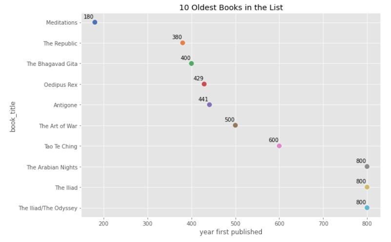
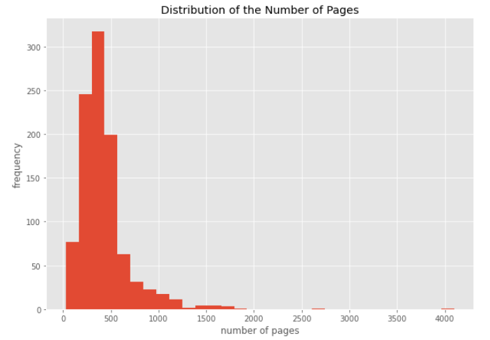
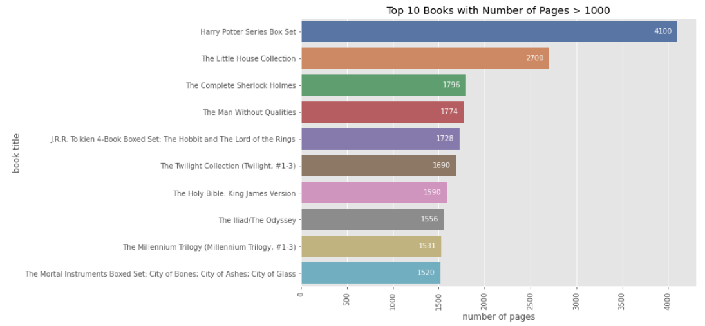
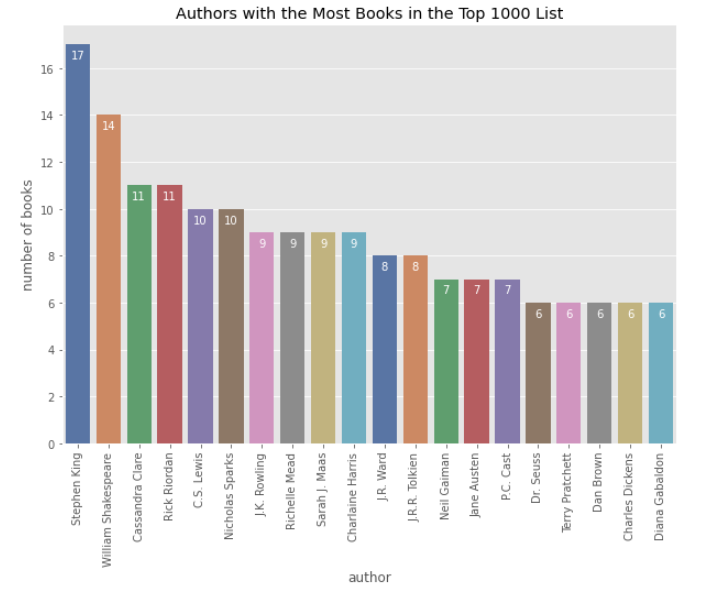
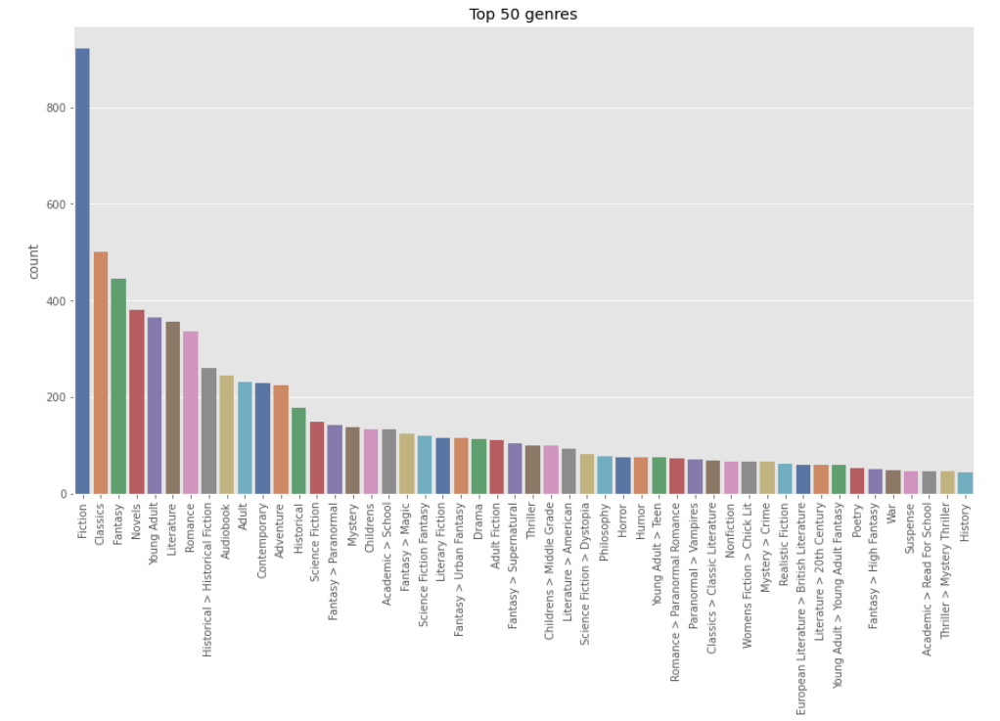
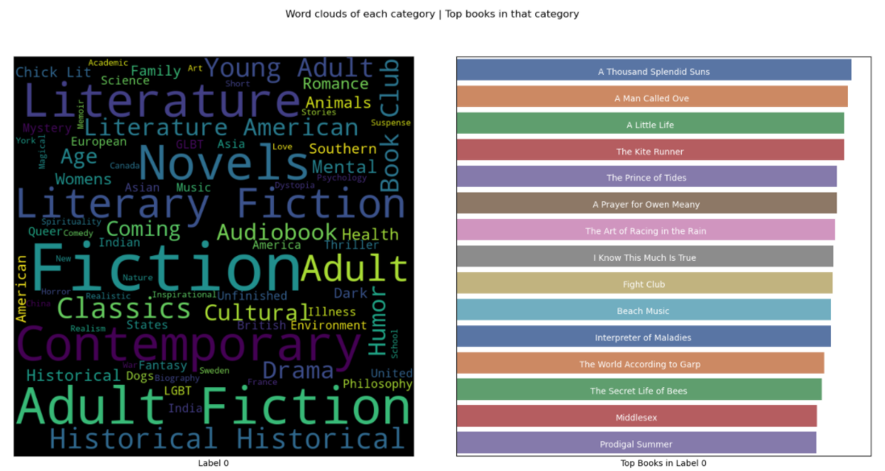

# ds_books

## Introduction
This project scrapes data from the [best books ever list](https://www.goodreads.com/list/show/1.Best_Books_Ever) on Goodreads, classifies the books based on their genre and creates a basic recommender system.

## Resources
[goodreads scraper](https://github.com/maria-antoniak/goodreads-scraper) created by [maria antoniak](https://github.com/maria-antoniak)

## EDA
  
  
  
  
  

## Model building

We used a K-Means algorithm to cluster our data into different categories. Then we created word clouds of the genres in each category, and found the top books in each category. An example of the wordcloud of a category can be found below. Please check the notebook (3_model_buildin.ipynp) for the full results. 

  
